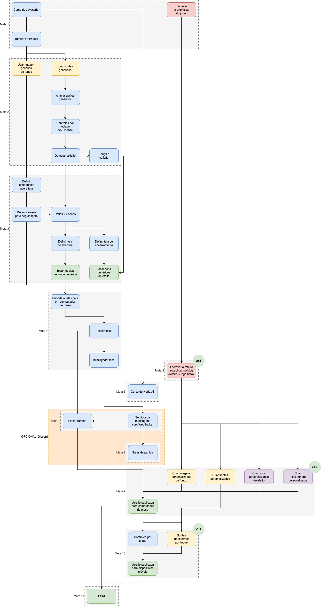

# Aplicação Web com Javascript

Em 2019, a turma de Administração de Redes de Computadores (ARC) projetava um dispositivo de atuação ampla: um _walkie-talkie_ modular para atender a vários esportes. Além da base comum, seriam desenvolvidos módulos como botões de emergência, comunicadores de rádio e outros para atividades como ciclismo, caminhada em trilhas e outros. Porém, apesar da boa ideia, era não apenas ambiciosa, mas onerosa. Além disso, faltava algo... Sabe quando faltam os brilhos nos olhos? Pois bem, na metade do projeto adotamos um caminho radical: abandonamos o projeto todo, todo mesmo, e decidimos programar jogos Web com Javascript. Escolhido o _framework_ [Phaser](https://phaser.io) (versão 3), partimos para a concepção do jogo, arte visual e sonora e, claro, codificação. Para ajudar, foi montado um plano de metas para auxiliar na gestão do projeto:

No ano seguinte, no segundo semestre de 2020 ([2020.1](https://github.com/boidacarapreta/arc20202/)) o projeto ganhou em forma e conteúdo. Na forma, foi definido um calendário de [9 entregas quinzenais](https://github.com/boidacarapreta/arc20202/milestones?direction=asc\&sort=due\_date\&state=closed) - com listas de vídeos de aula - e [quadro de tarefas](https://github.com/boidacarapreta/arc20202/projects/1?fullscreen=true). No conteúdo, incorporou conceitos de TIP (graças às metodologias ágeis adotadas, como Scrum e Kanban, foi possível modificar o projeto original durante a sua execução), ampliando o escopo do projeto original: o suporte a voz, em tempo real, entre os 2 jogadores. Além disso, para demonstrar o conceito de aplicação cliente-servidor, foi criado um [código variante](https://github.com/boidacarapreta/arc20202/tree/tip) que integra, inclusive, um (outro conceito inicial de) jogo feito com a ferramenta [Twine](https://twinery.org/). Assim, embora ambos os jogos não foram concluídos, apresentam as funcionalidades mínimas de jogo multijogador com audioconferência, seja um jogo 2D, ao estilo RPG, como baseado em roteiro não linear ([_choose your story_](https://chooseyourstory.com/)).

Twine, aliás, que foi base também de um jogo baseado em roteiro não linear para a disciplina de Cabeamento Estruturado (CAB). Aqui, o jogo trata da leitura dos conceitos e aplicação em um jogo de escolha de caminhos e resolução de problemas. Assim como ARC e TIP, o projeto teve conceitos de Scrum e Kanban: [quadro de tarefas](https://github.com/boidacarapreta/cab20202/projects/1?fullscreen=true) e [7 entregas quinzenais](https://github.com/boidacarapreta/cab20202/milestones?direction=asc\&sort=due\_date\&state=closed) com os [vídeos das aulas](https://www.youtube.com/watch?v=5A2EiefHOt0\&list=PLje9mMro7hT1Zp9Fd4UYo6quwJ4xUAvxd\&index=1). O formato adotado em ARC+TIP foi adotado também em CAB com o mesmo sucesso - com todo o conteúdo disponível para o público em geral.

O segundo semestre de 2021 (2021.2) repetiu aquela a mesma fórmula: foi [desenvolvido (o conceito inicial de) um jogo Web para 2 jogadores com suporte a áudio em tempo real](https://github.com/boidacarapreta/integrado20212/). Muito foi aproveitado em termos de conteúdo, em especial código-fonte e vídeos. Os [vídeos das aulas](https://www.youtube.com/watch?v=YhmVsBq2cnk\&list=PLje9mMro7hT2YXZ-tYs55bQRftDPAWDKP) também ficaram disponíveis para o público em geral.

Em [2022.1](https://github.com/boidacarapreta/adcipt20221), a mesma coisa. Porém, desta vez as aplicações cliente e servidor foram hospedadas separadamente: GitHub Pages e Heroku, além de suporte a salas de partidas simultâneas. Isso aumentou a complexidade de implementação, e o jogo de demonstração - aquele mesmo de 2020.2, atualizado - pode ser visto em: [https://boidacarapreta.github.io/adcipt20221/](https://boidacarapreta.github.io/adcipt20221/).

